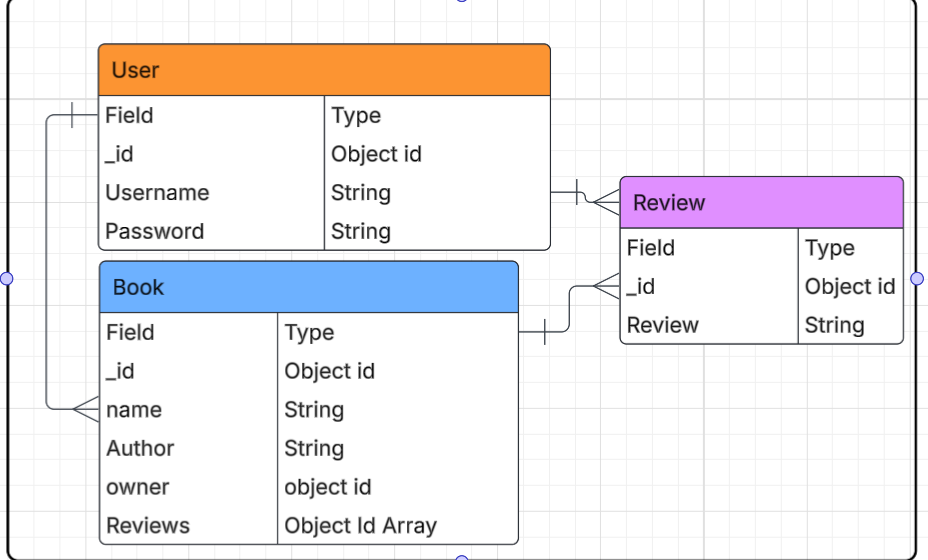

# Book Manager📚

**Welcome to Book Manager. An app designed for those specificaly who enjoy reading Books and Novels. You are able to log the books with the authors, while also giving them your personal review and what you thought about them**

##  Main Functionality include:
- Adding your book with the author and a personal review 
- Checking if the User Reviewed the Book and if not then it will show that someone else reviewed it 
- Editing the book for any changes
- Deleting the Book
- Adding another review on a already existing Book 
- Sign in and Sign Out. If not signed in then the user will not be able to log any books 
- Viewing other peoples Books 
- Full CRUD functionality.

## Attributions/Trello 
- https://trello.com/invite/b/68566606d9d323f1b9a8beb5/ATTI536ed914725f86f240853968e5ea5043EE9DA95B/project02 
- https://lucid.app/lucidchart/a3740e1b-fd74-47c0-a818-ed66b39af920/edit?viewport_loc=-966%2C-425%2C608%2C543%2C0_0&invitationId=inv_a05362a1-316d-4347-a7ac-5a797ef31b73 

## Technology Used
-  JavaScript 
- .ejs
- style.css
- Server.js 
- Mongoose
- .env
- .gitignore
- readme.md
- Lucid Chart (for ERD)
- Canvas (creating and designing images)

## Planned future enhancements 
- Adding an image to the book that has been logged 
- Rating functionality
- Improving on the layout or UI of the website

